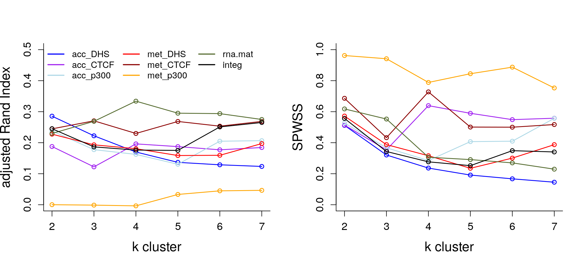
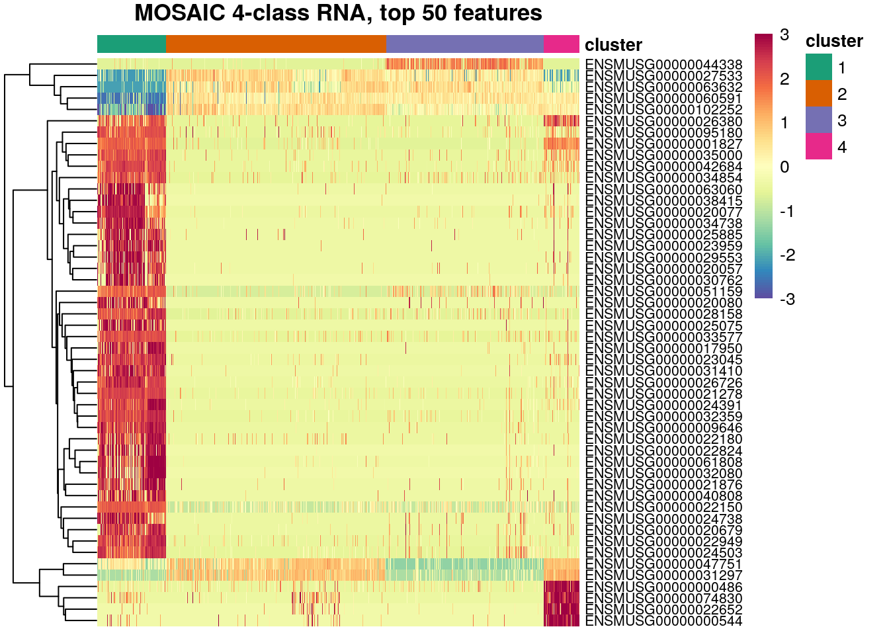

MOSAIC on scNMT\_seq Mouse Gastrulation data
================

## Introduction

We will be analyzing
[scNMT-seq](https://www.nature.com/articles/s41467-018-03149-4) study
via MOSAIC to understand mouse gastrulation on their epigenome and
transcriptome profiles to identify multi-omics signatures that
characterize stage and lineage.

[MOSAIC](https://github.com/arorarshi/MOSAIC) or Multi-Omics Supervised
Integrative Clustering is a response weighted clustering algorithm
inspired by [survClust](https://github.com/arorarshi/survClust), to
classify samples into clusters that are relevant to outcome of interest.

Each feature in a data type is weighed according to its association with
binary or categorical outcome of interest, and a weighted distance
matrix is computed\[1\]. This reduces the computation space considerably
from sample x feature to sample x sample. Samples are then projected
into a multi dimensional space preserving the distance between them, and
clustered with k-means algorithm to obtain class labels corresponding to
outcome.

## Preliminary Analysis

We ran MOSAIC for 10 rounds of 3-fold cross validation, with stage as
outcome of interest over seven data type - RNA, met\_CTCF, met\_DHS,
met\_p300, acc\_CTCF, acc\_DHS, acc\_p300, and integrating all of them,
to mine features that are associated with stage.

RNA data was standardized, whereas proportion data from other data types
was first transformed by taking their folded square root before
standardizing.

All the data was considered, including missing-ness, as MOSAIC can
handle incomplete information among features and data types.

We analyze MOSAIC obtained cross validated solutions over two metrics -
adjustedRandIndex and Standardized Pooled Within Sum of Squares (SPWSS)

We see that RNA expression predicts stage the best, at k=4 with maximum
adjusted Rand Index, followed by integration and met\_CTCF.

let’s take a look at RNA, k=4 solution.

<table>

<caption>

MOSAIC RNA 4-class vs stage

</caption>

<thead>

<tr>

<th style="text-align:left;">

</th>

<th style="text-align:right;">

E4.5

</th>

<th style="text-align:right;">

E5.5

</th>

<th style="text-align:right;">

E6.5

</th>

<th style="text-align:right;">

E7.5

</th>

</tr>

</thead>

<tbody>

<tr>

<td style="text-align:left;">

1

</td>

<td style="text-align:right;">

43

</td>

<td style="text-align:right;">

24

</td>

<td style="text-align:right;">

45

</td>

<td style="text-align:right;">

6

</td>

</tr>

<tr>

<td style="text-align:left;">

2

</td>

<td style="text-align:right;">

0

</td>

<td style="text-align:right;">

84

</td>

<td style="text-align:right;">

198

</td>

<td style="text-align:right;">

95

</td>

</tr>

<tr>

<td style="text-align:left;">

3

</td>

<td style="text-align:right;">

0

</td>

<td style="text-align:right;">

0

</td>

<td style="text-align:right;">

28

</td>

<td style="text-align:right;">

242

</td>

</tr>

<tr>

<td style="text-align:left;">

4

</td>

<td style="text-align:right;">

61

</td>

<td style="text-align:right;">

0

</td>

<td style="text-align:right;">

0

</td>

<td style="text-align:right;">

0

</td>

</tr>

</tbody>

</table>

## Future Work

  - Study the various MOSAIC solutions of different platforms.
  - Can integrated perform better?
  - Take into account other data types like `cgi`, `promoter` and
    `genebody`
  - With lineage as outcome

## Reference

1.  Xing, E. P., Jordan, M. I., Russell, S. J., & Ng, A. Y. (2003).
    Distance metric learning with application to clustering with
    side-information. In Advances in neural information processing
    systems (pp. 521-528).
