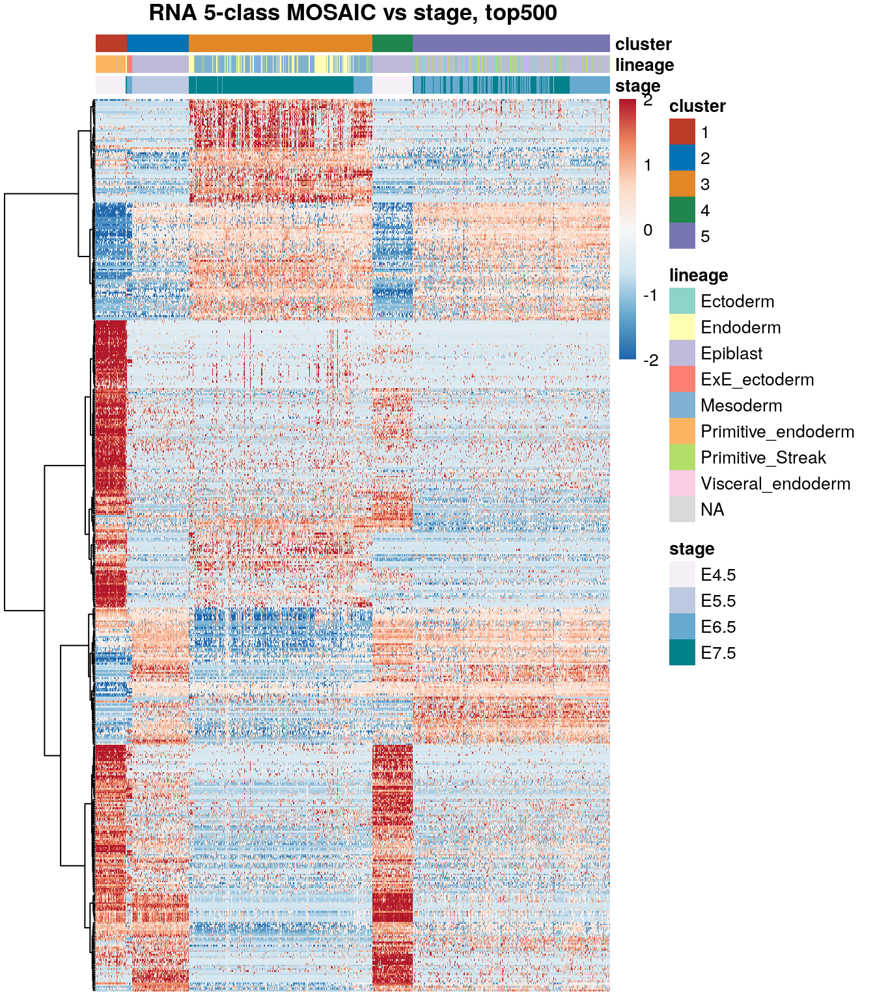
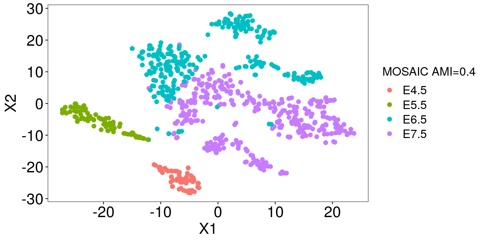

MOSAIC on scNMT\_seq Mouse Gastrulation data
================

## Introduction

We will be analyzing
[scNMT-seq](https://www.nature.com/articles/s41467-018-03149-4) study
via MOSAIC to understand mouse gastrulation on their epigenome and
transcriptome profiles to identify multi-omics signatures that
characterize stage and lineage.

[MOSAIC](https://github.com/arorarshi/MOSAIC) or Multi-Omics Supervised
Integrative Clustering is a response weighted clustering algorithm
inspired by [survClust](https://github.com/arorarshi/survClust), to
classify samples into clusters that are relevant to outcome of
interest.1

Each feature in a data type is weighed according to its association with
binary or categorical outcome of interest, and a weighted distance
matrix is computed 2. This reduces the computation space
considerably from sample x feature to sample x sample. Samples are then
projected into a multi dimensional space preserving the distance between
them, and clustered with k-means algorithm to obtain class labels
corresponding to outcome.

## Analysis

We ran MOSAIC for **50 rounds** of **5-fold** cross validation for
**k=2-7**, with stage and lineage as outcome of interest over 13 data
types -

  - RNA
  - met\_CTCF, met\_DHS, met\_p300, met\_genebody, met\_promoter,
    met\_cgi
  - acc\_CTCF, acc\_DHS, acc\_p300, acc\_genebody, acc\_promoter,
    acc\_cgi

and integrating all of them, to mine features that are associated with
outcome of interest.

RNA data was standardized, whereas proportion data from other data types
was first transformed by taking their folded square root before
standardizing.

All the data was considered, including missing-ness, as MOSAIC can
handle incomplete information among features and data types. If a data
type had more than 5000 features, the feature space was reduce to top
5000 most variable features.

Let’s take a look at stage and lineage distribution.

We removed samples belonging to Visceral Endoderms, see lineage table
below

<table>

<caption>

sample summary

</caption>

<tbody>

<tr>

<td style="text-align:left;">

stage=E4.5

</td>

<td style="text-align:left;">

103(13.66%)

</td>

</tr>

<tr>

<td style="text-align:left;">

E5.5

</td>

<td style="text-align:left;">

84(11.14%)

</td>

</tr>

<tr>

<td style="text-align:left;">

E6.5

</td>

<td style="text-align:left;">

225(29.84%)

</td>

</tr>

<tr>

<td style="text-align:left;">

E7.5

</td>

<td style="text-align:left;">

342(45.36%)

</td>

</tr>

</tbody>

</table>

<table>

<caption>

stage vs lineage

</caption>

<thead>

<tr>

<th style="text-align:left;">

</th>

<th style="text-align:right;">

Ectoderm

</th>

<th style="text-align:right;">

Endoderm

</th>

<th style="text-align:right;">

Epiblast

</th>

<th style="text-align:right;">

ExE\_ectoderm

</th>

<th style="text-align:right;">

Mesoderm

</th>

<th style="text-align:right;">

Primitive\_endoderm

</th>

<th style="text-align:right;">

Primitive\_Streak

</th>

</tr>

</thead>

<tbody>

<tr>

<td style="text-align:left;">

E4.5

</td>

<td style="text-align:right;">

0

</td>

<td style="text-align:right;">

0

</td>

<td style="text-align:right;">

60

</td>

<td style="text-align:right;">

0

</td>

<td style="text-align:right;">

0

</td>

<td style="text-align:right;">

43

</td>

<td style="text-align:right;">

0

</td>

</tr>

<tr>

<td style="text-align:left;">

E5.5

</td>

<td style="text-align:right;">

0

</td>

<td style="text-align:right;">

0

</td>

<td style="text-align:right;">

84

</td>

<td style="text-align:right;">

0

</td>

<td style="text-align:right;">

0

</td>

<td style="text-align:right;">

0

</td>

<td style="text-align:right;">

0

</td>

</tr>

<tr>

<td style="text-align:left;">

E6.5

</td>

<td style="text-align:right;">

0

</td>

<td style="text-align:right;">

0

</td>

<td style="text-align:right;">

146

</td>

<td style="text-align:right;">

8

</td>

<td style="text-align:right;">

28

</td>

<td style="text-align:right;">

0

</td>

<td style="text-align:right;">

43

</td>

</tr>

<tr>

<td style="text-align:left;">

E7.5

</td>

<td style="text-align:right;">

43

</td>

<td style="text-align:right;">

81

</td>

<td style="text-align:right;">

44

</td>

<td style="text-align:right;">

0

</td>

<td style="text-align:right;">

141

</td>

<td style="text-align:right;">

0

</td>

<td style="text-align:right;">

33

</td>

</tr>

</tbody>

</table>

## Results

We analyze MOSAIC obtained cross validated solutions over two metrics -
adjusted Mutual Information (AMI) and Standardized Pooled Within Sum of
Squares (SPWSS)

### Stage

  - RNA and Met promoter paltforms track close to each other, and are
    also on top of rest of the platforms in terms of been informative
    towards stage.

  - acc platforms are not as informative of stage, acc\_DHS seemed to be
    doing the best with AMI = 0.30. See circomaps below.

#### Let’s take a look at RNA MOSAIC solution

<table>

<caption>

MOSAIC rna vs stage, AMI= 0.59

</caption>

<thead>

<tr>

<th style="text-align:left;">

</th>

<th style="text-align:right;">

E4.5

</th>

<th style="text-align:right;">

E5.5

</th>

<th style="text-align:right;">

E6.5

</th>

<th style="text-align:right;">

E7.5

</th>

</tr>

</thead>

<tbody>

<tr>

<td style="text-align:left;">

1

</td>

<td style="text-align:right;">

44

</td>

<td style="text-align:right;">

0

</td>

<td style="text-align:right;">

0

</td>

<td style="text-align:right;">

2

</td>

</tr>

<tr>

<td style="text-align:left;">

2

</td>

<td style="text-align:right;">

0

</td>

<td style="text-align:right;">

83

</td>

<td style="text-align:right;">

8

</td>

<td style="text-align:right;">

0

</td>

</tr>

<tr>

<td style="text-align:left;">

3

</td>

<td style="text-align:right;">

0

</td>

<td style="text-align:right;">

0

</td>

<td style="text-align:right;">

31

</td>

<td style="text-align:right;">

238

</td>

</tr>

<tr>

<td style="text-align:left;">

4

</td>

<td style="text-align:right;">

59

</td>

<td style="text-align:right;">

0

</td>

<td style="text-align:right;">

0

</td>

<td style="text-align:right;">

0

</td>

</tr>

<tr>

<td style="text-align:left;">

5

</td>

<td style="text-align:right;">

0

</td>

<td style="text-align:right;">

1

</td>

<td style="text-align:right;">

186

</td>

<td style="text-align:right;">

102

</td>

</tr>

</tbody>

</table>

<table>

<caption>

MOSAIC rna vs lineage, AMI=0.54

</caption>

<thead>

<tr>

<th style="text-align:left;">

</th>

<th style="text-align:right;">

Ectoderm

</th>

<th style="text-align:right;">

Endoderm

</th>

<th style="text-align:right;">

Epiblast

</th>

<th style="text-align:right;">

ExE\_ectoderm

</th>

<th style="text-align:right;">

Mesoderm

</th>

<th style="text-align:right;">

Primitive\_endoderm

</th>

<th style="text-align:right;">

Primitive\_Streak

</th>

</tr>

</thead>

<tbody>

<tr>

<td style="text-align:left;">

1

</td>

<td style="text-align:right;">

0

</td>

<td style="text-align:right;">

2

</td>

<td style="text-align:right;">

1

</td>

<td style="text-align:right;">

0

</td>

<td style="text-align:right;">

0

</td>

<td style="text-align:right;">

43

</td>

<td style="text-align:right;">

0

</td>

</tr>

<tr>

<td style="text-align:left;">

2

</td>

<td style="text-align:right;">

0

</td>

<td style="text-align:right;">

0

</td>

<td style="text-align:right;">

83

</td>

<td style="text-align:right;">

8

</td>

<td style="text-align:right;">

0

</td>

<td style="text-align:right;">

0

</td>

<td style="text-align:right;">

0

</td>

</tr>

<tr>

<td style="text-align:left;">

3

</td>

<td style="text-align:right;">

0

</td>

<td style="text-align:right;">

79

</td>

<td style="text-align:right;">

0

</td>

<td style="text-align:right;">

0

</td>

<td style="text-align:right;">

167

</td>

<td style="text-align:right;">

0

</td>

<td style="text-align:right;">

23

</td>

</tr>

<tr>

<td style="text-align:left;">

4

</td>

<td style="text-align:right;">

0

</td>

<td style="text-align:right;">

0

</td>

<td style="text-align:right;">

59

</td>

<td style="text-align:right;">

0

</td>

<td style="text-align:right;">

0

</td>

<td style="text-align:right;">

0

</td>

<td style="text-align:right;">

0

</td>

</tr>

<tr>

<td style="text-align:left;">

5

</td>

<td style="text-align:right;">

43

</td>

<td style="text-align:right;">

0

</td>

<td style="text-align:right;">

191

</td>

<td style="text-align:right;">

0

</td>

<td style="text-align:right;">

2

</td>

<td style="text-align:right;">

0

</td>

<td style="text-align:right;">

53

</td>

</tr>

</tbody>

</table>

**Let us take a look at some analysis with kmeans**

<table>

<caption>

kmeans rna vs stage, AMI= 0.42

</caption>

<thead>

<tr>

<th style="text-align:left;">

</th>

<th style="text-align:right;">

E4.5

</th>

<th style="text-align:right;">

E5.5

</th>

<th style="text-align:right;">

E6.5

</th>

<th style="text-align:right;">

E7.5

</th>

</tr>

</thead>

<tbody>

<tr>

<td style="text-align:left;">

1

</td>

<td style="text-align:right;">

44

</td>

<td style="text-align:right;">

0

</td>

<td style="text-align:right;">

0

</td>

<td style="text-align:right;">

2

</td>

</tr>

<tr>

<td style="text-align:left;">

2

</td>

<td style="text-align:right;">

0

</td>

<td style="text-align:right;">

76

</td>

<td style="text-align:right;">

124

</td>

<td style="text-align:right;">

89

</td>

</tr>

<tr>

<td style="text-align:left;">

3

</td>

<td style="text-align:right;">

3

</td>

<td style="text-align:right;">

8

</td>

<td style="text-align:right;">

71

</td>

<td style="text-align:right;">

20

</td>

</tr>

<tr>

<td style="text-align:left;">

4

</td>

<td style="text-align:right;">

56

</td>

<td style="text-align:right;">

0

</td>

<td style="text-align:right;">

0

</td>

<td style="text-align:right;">

0

</td>

</tr>

<tr>

<td style="text-align:left;">

5

</td>

<td style="text-align:right;">

0

</td>

<td style="text-align:right;">

0

</td>

<td style="text-align:right;">

30

</td>

<td style="text-align:right;">

231

</td>

</tr>

</tbody>

</table>

<table>

<caption>

kmeans rna vs lineage, AMI=0.49

</caption>

<thead>

<tr>

<th style="text-align:left;">

</th>

<th style="text-align:right;">

Ectoderm

</th>

<th style="text-align:right;">

Endoderm

</th>

<th style="text-align:right;">

Epiblast

</th>

<th style="text-align:right;">

ExE\_ectoderm

</th>

<th style="text-align:right;">

Mesoderm

</th>

<th style="text-align:right;">

Primitive\_endoderm

</th>

<th style="text-align:right;">

Primitive\_Streak

</th>

</tr>

</thead>

<tbody>

<tr>

<td style="text-align:left;">

1

</td>

<td style="text-align:right;">

0

</td>

<td style="text-align:right;">

2

</td>

<td style="text-align:right;">

1

</td>

<td style="text-align:right;">

0

</td>

<td style="text-align:right;">

0

</td>

<td style="text-align:right;">

43

</td>

<td style="text-align:right;">

0

</td>

</tr>

<tr>

<td style="text-align:left;">

2

</td>

<td style="text-align:right;">

42

</td>

<td style="text-align:right;">

0

</td>

<td style="text-align:right;">

216

</td>

<td style="text-align:right;">

3

</td>

<td style="text-align:right;">

0

</td>

<td style="text-align:right;">

0

</td>

<td style="text-align:right;">

28

</td>

</tr>

<tr>

<td style="text-align:left;">

3

</td>

<td style="text-align:right;">

1

</td>

<td style="text-align:right;">

3

</td>

<td style="text-align:right;">

61

</td>

<td style="text-align:right;">

5

</td>

<td style="text-align:right;">

12

</td>

<td style="text-align:right;">

0

</td>

<td style="text-align:right;">

20

</td>

</tr>

<tr>

<td style="text-align:left;">

4

</td>

<td style="text-align:right;">

0

</td>

<td style="text-align:right;">

0

</td>

<td style="text-align:right;">

56

</td>

<td style="text-align:right;">

0

</td>

<td style="text-align:right;">

0

</td>

<td style="text-align:right;">

0

</td>

<td style="text-align:right;">

0

</td>

</tr>

<tr>

<td style="text-align:left;">

5

</td>

<td style="text-align:right;">

0

</td>

<td style="text-align:right;">

76

</td>

<td style="text-align:right;">

0

</td>

<td style="text-align:right;">

0

</td>

<td style="text-align:right;">

157

</td>

<td style="text-align:right;">

0

</td>

<td style="text-align:right;">

28

</td>

</tr>

</tbody>

</table>

#### Other MOSAIC solutions

Make a *circomap* of remaining subtypes, and stage and lineage
classification

### Integrated solution

Will add 07/10

### Met promoter vs RNA

Let’s take a look at the two platforms, RNA and Met promoter that are
most informative for stage.

<table>

<caption>

Met promoter vs stage, AMI=0.53

</caption>

<thead>

<tr>

<th style="text-align:left;">

</th>

<th style="text-align:right;">

E4.5

</th>

<th style="text-align:right;">

E5.5

</th>

<th style="text-align:right;">

E6.5

</th>

<th style="text-align:right;">

E7.5

</th>

</tr>

</thead>

<tbody>

<tr>

<td style="text-align:left;">

1

</td>

<td style="text-align:right;">

0

</td>

<td style="text-align:right;">

0

</td>

<td style="text-align:right;">

29

</td>

<td style="text-align:right;">

208

</td>

</tr>

<tr>

<td style="text-align:left;">

2

</td>

<td style="text-align:right;">

0

</td>

<td style="text-align:right;">

26

</td>

<td style="text-align:right;">

188

</td>

<td style="text-align:right;">

129

</td>

</tr>

<tr>

<td style="text-align:left;">

3

</td>

<td style="text-align:right;">

103

</td>

<td style="text-align:right;">

0

</td>

<td style="text-align:right;">

1

</td>

<td style="text-align:right;">

0

</td>

</tr>

<tr>

<td style="text-align:left;">

4

</td>

<td style="text-align:right;">

0

</td>

<td style="text-align:right;">

58

</td>

<td style="text-align:right;">

7

</td>

<td style="text-align:right;">

5

</td>

</tr>

</tbody>

</table>

Let’s see how this looks with RNA solution

<table>

<caption>

Met promoter vs RNA, AMI=0.45

</caption>

<thead>

<tr>

<th style="text-align:left;">

</th>

<th style="text-align:right;">

1

</th>

<th style="text-align:right;">

2

</th>

<th style="text-align:right;">

3

</th>

<th style="text-align:right;">

4

</th>

<th style="text-align:right;">

5

</th>

</tr>

</thead>

<tbody>

<tr>

<td style="text-align:left;">

1

</td>

<td style="text-align:right;">

0

</td>

<td style="text-align:right;">

0

</td>

<td style="text-align:right;">

140

</td>

<td style="text-align:right;">

0

</td>

<td style="text-align:right;">

97

</td>

</tr>

<tr>

<td style="text-align:left;">

2

</td>

<td style="text-align:right;">

0

</td>

<td style="text-align:right;">

25

</td>

<td style="text-align:right;">

126

</td>

<td style="text-align:right;">

0

</td>

<td style="text-align:right;">

192

</td>

</tr>

<tr>

<td style="text-align:left;">

3

</td>

<td style="text-align:right;">

44

</td>

<td style="text-align:right;">

1

</td>

<td style="text-align:right;">

0

</td>

<td style="text-align:right;">

59

</td>

<td style="text-align:right;">

0

</td>

</tr>

<tr>

<td style="text-align:left;">

4

</td>

<td style="text-align:right;">

2

</td>

<td style="text-align:right;">

65

</td>

<td style="text-align:right;">

3

</td>

<td style="text-align:right;">

0

</td>

<td style="text-align:right;">

0

</td>

</tr>

</tbody>

</table>

Interesting to see that even though individual RNA MSOAIC solution (k=5)
and Met promoter (k=4) are both informative towards stage with AMI 0.59
and 0.53 respectively, they are conveying slightly different underlying
information classifying stage. AMI RNA with Met promoter 0.45

Note, that due to missing-ness in Met Promoter data, we didn’t perform
an overlap between common features between RNA and Met Promoter .

## Conclusion

  - MOSAIC finds supervised clusters, with an outcome of interest in
    mind. Where kmeans might give mixed results. Supervised clustering
    is much more efficient and helps in sorting out different signals

  - MOSAIC can run with missing data. However interpretations should be
    made carefully.

  - MOSAIC reduces computation space from sample x feature to sample x
    sample

  - Efficient in dealing with noisy features

## References

1.  Arora A, Olshen AB, Seshan VE, and Shen R. Pan-cancer identification
    of clinically relevant genomic subtypes using outcome-weighted
    integrative clustering. Biorxiv

2.  Xing, E. P., Jordan, M. I., Russell, S. J., & Ng, A. Y. (2003).
    Distance metric learning with application to clustering with
    side-information. In Advances in neural information processing
    systems (pp. 521-528).
